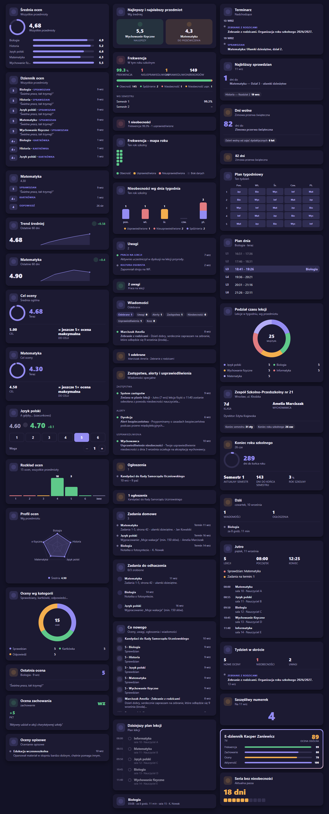

# Librus Synergia Cards

Custom Lovelace cards for [`ha-librus-synergia`](https://github.com/MichalZaniewicz/ha-librus-synergia) (the
`librus_synergia` integration) - purpose-built widgets instead of wiring its sensors and calendars into
generic entity/gauge cards by hand.

[](https://my.home-assistant.io/redirect/hacs_repository/?owner=MichalZaniewicz&repository=ha-librus-synergia-cards&category=plugin)



> [!TIP]
> ⭐ **Enjoying these cards?** Every star is real motivation to keep building new features :)

<!-- The badge lives OUTSIDE the alert on purpose: Home Assistant/HACS rewrites a GitHub alert
into <ha-alert> and drops every child whose textContent is empty, which silently removes any
 placed inside it. -->

[](https://github.com/MichalZaniewicz/ha-librus-synergia-cards)

## Cards

| Card | `type` | What it shows |
|---|---|---|
| Grade average | `custom:librus-grades-card` | Overall weighted average and per-subject averages with comparison bars |
| Grade log | `custom:librus-grade-log-card` | Every grade from every subject, newest first, one chronological list |
| Subject grades | `custom:librus-subject-grades-card` | Every grade from ONE subject you pick in the card's own config |
| Grade trend | `custom:librus-grade-trend-card` | How the overall (or one subject's) average has moved over the last 60 days, from its own state history |
| Grade distribution | `custom:librus-grade-distribution-card` | Histogram - how many 6s/5s/4s/... across every subject |
| Latest grade | `custom:librus-latest-grade-card` | The most recent grade across all subjects, with the teacher's comment if any |
| Behaviour grade | `custom:librus-behaviour-grade-card` | The formal "ocena zachowania" - distinct from the free-text notices below |
| Descriptive grades | `custom:librus-descriptive-grades-card` | Non-numeric descriptive assessment, for schools that use it |
| Attendance | `custom:librus-attendance-card` | Real absences and lates, full per-type breakdown, independently-computed percentage, and a per-semester breakdown |
| Attendance tile | `custom:librus-attendance-tile-card` | Compact single-row tile - absence count + percentage |
| Behaviour notices | `custom:librus-behaviour-notices-card` | Recent "uwagi" with category and sentiment (positive/negative/neutral) |
| Behaviour notices tile | `custom:librus-behaviour-notices-tile-card` | Compact single-row tile - count + latest category |
| Messages | `custom:librus-messages-card` | Unread counts across every Wiadomości mailbox, with a preview of recent inbox messages - click one to load its full content (requires `ha-librus-synergia` 0.4.11+; this marks the message read in Librus, exactly like opening it in the Librus app) |
| Messages tile | `custom:librus-messages-tile-card` | Compact single-row tile - unread count + latest sender/topic |
| Substitutions & alerts | `custom:librus-substitutions-card` | Full content (not just a count) for "Zastępstwa" and "Alerty" - click one to load it in full (requires `ha-librus-synergia` 0.4.13+) |
| Announcements | `custom:librus-announcements-card` | Unread items from the school notice board - click one to expand its full content (requires `ha-librus-synergia` 0.4.17+; no read-marking side effect, unlike Wiadomości) |
| Announcements tile | `custom:librus-announcements-tile-card` | Compact single-row tile - unread count + latest subject |
| Homework assignments | `custom:librus-homework-assignments-card` | Real "zadania domowe" with due dates - distinct from the general agenda feed |
| What's new | `custom:librus-recent-activity-card` | One chronological feed merging the most recent grades, notices, announcements and messages |
| Today's lessons | `custom:librus-today-lessons-card` | A timeline of today's timetable, highlighting the current lesson |
| Next lesson | `custom:librus-next-lesson-tile-card` | A single-row tile with the next (or current) lesson, for denser dashboards |
| Agenda | `custom:librus-agenda-card` | Upcoming terminarz events, grouped by date |
| Free days | `custom:librus-free-days-card` | A countdown to the next school break, plus a short list of the next few |
| Week timetable | `custom:librus-week-timetable-card` | The whole week's lesson grid at a glance |
| School & class | `custom:librus-school-card` | School name/address/head teacher, class, homeroom teacher, semester dates |
| Today | `custom:librus-today-card` | Lucky number, unread messages/announcements and the next lesson in one card |
| Week in review | `custom:librus-week-summary-card` | New grades, absences, notices and the next agenda item this week |
| Lucky number | `custom:librus-lucky-number-card` | The latest "szczęśliwy numerek" in large type - labeled "For {date}" instead of "Today" when Librus has published the next school day's number ahead of time (requires `ha-librus-synergia` 0.4.15+) |
| Student card | `custom:librus-student-card` | A playful trading-card style summary computed from attendance/behaviour/grades/activity |
| Absence-free streak | `custom:librus-streak-card` | How many consecutive days since the last real absence |

Each card auto-detects your child's device - **zero YAML required** for the common case of one student.
If you ever have more than one, the card's visual editor shows a device picker.

```yaml
type: custom:librus-grades-card
```

**Subject grades** takes one extra field, editable from its own visual editor (a subject picker):

```yaml
type: custom:librus-subject-grades-card
subject_id: 42005
```

**Grade trend** uses the same subject-picker editor, but `subject_id` is *optional* there -
leave it unset for the Overall average's trend, or set it for one subject's:

```yaml
type: custom:librus-grade-trend-card
subject_id: 42005 # omit for the overall average
```

## Languages

Every label follows your Home Assistant language automatically - English and Polish are built in
(`src/translations/`). Anything else falls back to English. Adding a language is one new typed
file - see [Adding a language](#adding-a-language) below.

## Installation

1. HACS → ⋮ → **Custom repositories** → add this repo as category **Dashboard** (or use the
   badge above) → install **Librus Synergia Cards**.
2. Add a card to any dashboard with `type: custom:librus-grades-card` (or any other type from the
   table above) - no other configuration needed for a single student's account.

Manual install: copy `dist/librus-synergia-cards.js` into `<config>/www/`, then Settings →
Dashboards → Resources → add `/local/librus-synergia-cards.js` as a JavaScript module.

Requires [`ha-librus-synergia`](https://github.com/MichalZaniewicz/ha-librus-synergia) already set up.

## Design

Every card is a real `ha-card`, so it inherits your Home Assistant theme's colors, radius and
shadow automatically. The brand accent (indigo) and secondary accent (amber) come from the
`librus_synergia` brand icon itself - an indigo notebook with an amber bookmark ribbon - so this
repo reads as the same product family. Semantic colors (good/warning/bad - used for attendance,
sentiment, streaks) are deliberately separate from that brand accent. See
[`src/utils/style-tokens.ts`](src/utils/style-tokens.ts) for the full token set.

## Development

```bash
npm install
npm run build       # -> dist/librus-synergia-cards.js (committed to the repo, HACS serves it directly)
npm run watch        # rebuild on change
npm run typecheck    # tsc --noEmit across the whole src/ tree
```

No live Home Assistant instance is needed to work on these cards. Serve the repo root with any
static file server (`import()`-ing a local module needs `http://`, not `file://` - Chrome blocks
cross-origin module fetches from `file://`) and open `dev/index.html` after building - it loads the
real compiled bundle against a hand-built mock `hass` object covering every card in both its normal
and empty state, with a light/dark toggle and a language switcher.

### Adding a new card

1. Add `src/librus-<name>-card.ts` extending `LibrusBaseCard` ([`src/utils/base-card.ts`](src/utils/base-card.ts)) -
   it gives you dark-mode sync, device resolution and a consistent empty/error state for free.
2. Reuse [`src/utils/style-tokens.ts`](src/utils/style-tokens.ts) (`librusTokens` +
   `librusSharedStyles`) and [`src/utils/render-helpers.ts`](src/utils/render-helpers.ts)
   (`segmentedBar`, `progressRing`) before writing new CSS/SVG - most layouts in this family are
   built entirely from those two files.
3. Register it in [`src/librus-synergia-cards.ts`](src/librus-synergia-cards.ts) (one `import` + one
   `window.customCards.push(...)` entry). `getConfigElement()` can almost always just return
   `document.createElement("librus-device-editor")` - every card's config is currently just an
   optional `device_id`, except **Subject grades**, which uses
   [`src/librus-subject-picker-editor.ts`](src/librus-subject-picker-editor.ts) for its extra
   `subject_id` field.
4. Every user-facing string goes through `t(hass, key)` from
   [`src/utils/localize.ts`](src/utils/localize.ts) - add the key to
   [`src/translations/en.ts`](src/translations/en.ts) first (the canonical key list) and
   TypeScript will then require it in `pl.ts` too.
5. Add a mock-data entry in [`dev/index.html`](dev/index.html) and verify both the happy-path and
   empty-state render.

### Adding a language

Copy `src/translations/en.ts` to `src/translations/<code>.ts`, translate every value (TypeScript
will error if a key is missing or extra), then register it in `LANGUAGES` in
[`src/utils/localize.ts`](src/utils/localize.ts).

## Status

Entity discovery reads Home Assistant's entity registry by `translation_key`, which
`librus_synergia` sets equal to each sensor's internal key (`attendance`, `lucky_number`, ...) -
that keeps discovery language-independent and immune to the user renaming entities. The one
exception is `subject_average`, shared by every dynamically-discovered per-subject sensor - the
subject NAME comes from that entity's own `subject` attribute (added in `ha-librus-synergia`
v0.4.7 specifically for this), not from `entity_id` or `friendly_name`, both of which are
per-language and/or user-renameable.

The calendar-reading cards (Today's lessons, Agenda, Free days, Week timetable) fetch events via
Home Assistant's REST API (`GET /api/calendars/<entity_id>?start=...&end=...`) rather than reading
sensor state - `src/utils/calendar.ts` normalizes both response shapes HA has shipped for
`start`/`end` (a bare ISO string, and a Google-Calendar-style `{date}`/`{dateTime}` object)
defensively, since which one a given HA version sends wasn't verified against every version this
repo might run on.

## Disclaimer

An unofficial companion to an unofficial integration - not affiliated with or endorsed by Librus.
