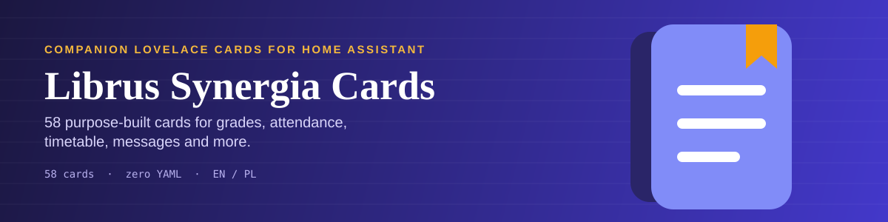
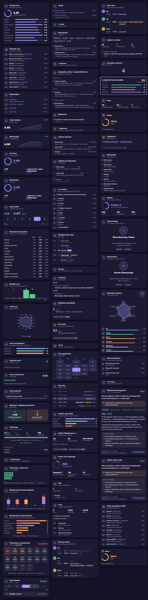

# Librus Synergia Cards

<p align="center">
  
</p>

Custom Lovelace cards for [`ha-librus-synergia`](https://github.com/MichalZaniewicz/ha-librus-synergia) (the
`librus_synergia` integration) - purpose-built widgets instead of wiring its sensors and calendars into
generic entity/gauge cards by hand.

> [!TIP]
> ⭐ **Enjoying these cards?** Every star is real motivation to keep building new features :)
>
> ☕ Want to say thanks another way? You can [buy me a coffee](https://buymeacoffee.com/zanula).

<!-- The badge lives OUTSIDE the alert on purpose: Home Assistant/HACS rewrites a GitHub alert
into <ha-alert> and drops every child whose textContent is empty, which silently removes any
 placed inside it. -->

[](https://github.com/MichalZaniewicz/ha-librus-synergia-cards) [](https://buymeacoffee.com/zanula)

<p align="center">
  <a href="https://my.home-assistant.io/redirect/hacs_repository/?owner=MichalZaniewicz&repository=ha-librus-synergia-cards&category=plugin"></a>
</p>



## Cards

| Card | `type` | What it shows |
|---|---|---|
| Grade average | `custom:librus-grades-card` | Overall average (weighted, or arithmetic if the integration's average mode says so) and per-subject averages with comparison bars (a subject graded in points shows its percentage) |
| School trips | `custom:librus-school-trips-card` | The next school trip - date, how the class travels, the route and the coordinator - with a "tomorrow" / "in N days" badge, and the trips after it. Options: title, how many trips to list. Needs `ha-librus-synergia` 0.12.0+ (Next school trip sensor) |
| What was taught | `custom:librus-lesson-topics-card` | The topics of the last few school days, day by day and lesson by lesson; lessons the student missed are marked, so it doubles as a "what to catch up on" list. Options: title, number of school days. Needs `ha-librus-synergia` 0.12.0+ (Lesson topics sensor) |
| Grade log | `custom:librus-grade-log-card` | Every grade from every subject, newest first, one chronological list (point grades as "17/20 85%") |
| Subject grades | `custom:librus-subject-grades-card` | Every grade from ONE subject you pick in the card's own config (point grades as "17/20 85%") |
| Grade trend | `custom:librus-grade-trend-card` | How the overall (or one subject's) average has moved over the last 60 days, from its own state history |
| Grade goal | `custom:librus-grade-goal-card` | Progress ring toward a target average you pick (overall or one subject), plus a rough "how many more top grades" estimate |
| Grade simulator | `custom:librus-grade-simulator-card` | Tap a grade + weight and see where the chosen subject's average would land (rough estimate) |
| Semester comparison | `custom:librus-semester-comparison-card` | Semester 1 vs 2 average per subject, side by side, with the change - fills in as semester 2 data lands |
| Grade distribution | `custom:librus-grade-distribution-card` | Histogram - how many 6s/5s/4s/... across every subject |
| Grade profile (radar) | `custom:librus-grades-radar-card` | Every subject's average on one spider/radar chart, so a strong or weak subject stands out at a glance |
| Grades by category | `custom:librus-grade-category-distribution-card` | A ranked horizontal bar chart of how the year's grades split across categories (Sprawdzian/Kartkówka/Odpowiedź/...) |
| Latest grade | `custom:librus-latest-grade-card` | The most recent grade across all subjects, with the teacher's comment if any |
| Behaviour grade | `custom:librus-behaviour-grade-card` | The formal "ocena zachowania" - distinct from the free-text notices below |
| Descriptive grades | `custom:librus-descriptive-grades-card` | Non-numeric descriptive assessment, for schools that use it |
| Report card forecast | `custom:librus-report-card-card` | The report card the averages point to: a tile per subject with the forecast grade (red when heading for a 1, amber when it dropped recently), the forecast report-card average with progress towards a distinction (4.75), and the subjects where one grade changes something. Thresholds come from the integration's options (requires `ha-librus-synergia` 0.12.0+) |
| Best & weakest subject | `custom:librus-subject-spotlight-card` | The two extremes by average, side by side - computed from the per-subject average sensors, no backend changes needed |
| Attendance | `custom:librus-attendance-card` | Percentage, unexcused count and excused count as their own stat tiles (requires `ha-librus-synergia` 0.4.19+), full per-type breakdown below (excused absences in their own color, distinct from unexcused), and a per-semester breakdown |
| Attendance tile | `custom:librus-attendance-tile-card` | Compact single-row tile - unexcused absence count + percentage, with excused ones called out separately (requires `ha-librus-synergia` 0.4.19+) |
| Attendance heatmap | `custom:librus-attendance-heatmap-card` | A GitHub-contributions-style calendar of the school year so far, one square per school day colored by that day's worst attendance status (requires `ha-librus-synergia` 0.4.20+) |
| Absences by weekday | `custom:librus-attendance-weekday-card` | Which weekday absences/lates tend to land on - each weekday's bar split into its own excused/unexcused/late segments (requires `ha-librus-synergia` 0.4.21+) |
| Absences by subject | `custom:librus-attendance-subject-card` | Ranked bar per subject showing which one is missed most often, split into excused/unexcused (requires `ha-librus-synergia` 0.7.7+) |
| Attendance by subject | `custom:librus-subject-attendance-card` | A tile per subject with the % of lessons attended, coloured green / amber / red (below 50%); subjects with fewer than 5 lessons greyed out (requires `ha-librus-synergia` 0.9.0+) |
| School day | `custom:librus-school-day-card` | Today's lessons as a strip of cells with short subject names - or the next school day's once school is out: the current lesson highlighted, past ones dimmed, cancelled ones struck through, substitutions, room changes and moved lessons outlined. Below: the lesson now (and minutes left), the break before the next one, or the first lesson and when it starts |
| Behaviour notices | `custom:librus-behaviour-notices-card` | Recent "uwagi" with category and sentiment (positive/negative/neutral) |
| Behaviour notices tile | `custom:librus-behaviour-notices-tile-card` | Compact single-row tile - count + latest category |
| Messages | `custom:librus-messages-card` | Unread counts across every Wiadomości mailbox, with a preview of recent messages from the chosen mailbox (inbox by default) - click one to load its full content (requires `ha-librus-synergia` 0.4.11+; this marks the message read in Librus, exactly like opening it in the Librus app). A paperclip badge marks messages with an attachment; the expanded view shows its real filename (requires 0.7.2+); with 0.12.0+ a tap on the file name downloads it to your device, without saving it in Home Assistant or opening the message in Librus |
| Messages tile | `custom:librus-messages-tile-card` | Compact single-row tile - unread count + latest sender/topic |
| Substitutions, alerts & justifications | `custom:librus-substitutions-card` | Full content (not just a count) for "Zastępstwa", "Alerty" and "Usprawiedliwienia" (a submitted absence excuse and its pending/accepted status) - click one to load it in full (requires `ha-librus-synergia` 0.4.13+, justifications 0.4.18+). Same paperclip badge + attachment filename as the Messages card (requires 0.7.2+). |
| Announcements | `custom:librus-announcements-card` | Unread items from the school notice board - click one to expand its full content (requires `ha-librus-synergia` 0.4.17+; no read-marking side effect, unlike Wiadomości) |
| Announcements tile | `custom:librus-announcements-tile-card` | Compact single-row tile - unread count + latest subject |
| Homework assignments | `custom:librus-homework-assignments-card` | Real "zadania domowe" with due dates - distinct from the general agenda feed |
| Homework checklist | `custom:librus-homework-checklist-card` | The same list with a tick-box per item; ticked items drop to the bottom. With `ha-librus-synergia` 0.11.0+ the ticks go to its Homework to-do list, so every device sees the same; on older versions they stay in this browser |
| What's new | `custom:librus-recent-activity-card` | One chronological feed merging the most recent grades, notices, announcements and messages |
| Today's lessons | `custom:librus-today-lessons-card` | A timeline of today's timetable, highlighting the current lesson. Marks cancelled lessons, substitutions (with what they replace), room changes ("room 12 → 21") and moved lessons |
| Next lesson | `custom:librus-next-lesson-tile-card` | A single-row tile with the next (or current) lesson, for denser dashboards |
| Agenda | `custom:librus-agenda-card` | Upcoming terminarz events, grouped by date |
| Next exam | `custom:librus-exam-countdown-card` | A countdown to the next test/exam - uses the integration's `next_exam` sensor when present, otherwise scans the Agenda feed for "[Sprawdzian]"-tagged items |
| Free days | `custom:librus-free-days-card` | A countdown to the next school break, plus a short list of the next few |
| Free days tile | `custom:librus-free-days-tile-card` | Compact single-row tile - days until the next break |
| Week timetable | `custom:librus-week-timetable-card` | The whole week's lesson grid at a glance, with the lesson happening right now highlighted; substitutions, room changes and moved lessons are outlined (details in the tooltip) |
| Today's schedule | `custom:librus-bell-schedule-card` | The day's period grid (bell times) with each period's subject and room from the timetable, current period highlighted, past ones dimmed; once the day's lessons are over it shows the next school day - needs the integration's `bell_schedule` attribute |
| Lesson time split | `custom:librus-subject-time-card` | A ranked horizontal bar chart of how the week's lesson slots split across subjects, from the timetable |
| School & class | `custom:librus-school-card` | School name/address/head teacher, class, homeroom teacher, semester dates |
| End of school year | `custom:librus-school-year-card` | A countdown to the end of the school year, a progress ring for how far through it you are, and the current semester's own end date |
| Today | `custom:librus-today-card` | Lucky number, unread messages/announcements and the next lesson in one card |
| Tomorrow | `custom:librus-tomorrow-card` | The next school day (skips the weekend): its lessons, plus any homework due or exam that day |
| First lesson | `custom:librus-first-lesson-card` | **Every child at once**: when and with what each one starts today and on the next school day, who has to leave first, a cancelled first lesson or a substitution. Made for families with several kids |
| Week in review | `custom:librus-week-summary-card` | New grades, absences, notices and the next agenda item this week |
| Lucky number | `custom:librus-lucky-number-card` | The latest "szczęśliwy numerek" in large type - labeled "For {date}" instead of "Today" when Librus has published the next school day's number ahead of time (requires `ha-librus-synergia` 0.4.15+) |
| Student card | `custom:librus-student-card` | A playful trading-card style summary computed from attendance/behaviour/grades/activity |
| Streaks | `custom:librus-streak-card` | Three "passy": days without an absence, days without a negative behaviour note, consecutive good grades in a row (requires `ha-librus-synergia` 0.6.0+ for the two new ones - falls back to the old attendance-only computation on an older backend) |
| Rank | `custom:librus-rank-card` | Cosmetic Bronze/Silver/Gold/Diamond tier from your overall average, as a progress ring toward the next one up (requires `ha-librus-synergia` 0.6.0+) |
| Achievements | `custom:librus-achievements-card` | A trophy case for the `librus_synergia_achievement_unlocked` event (requires `ha-librus-synergia` 0.6.0+) - there's no backend sensor listing achievement history, so this card subscribes to the event bus directly and keeps its own list in `localStorage`. Only grows going forward from whenever the card is first added; earlier achievements can't be recovered. Also shows a "N more to: ..." hint for the nearest un-unlocked streak milestone, computed live from the current streak sensors |
| Teachers | `custom:librus-teachers-card` | Homeroom teacher plus every subject teacher, one directory in one place (requires `ha-librus-synergia` 0.6.0+ for the `subject_teachers` attribute) |
| Level | `custom:librus-level-card` | A pure-fun XP meter, separate from Rank - it only ever goes up (XP for every grade ever recorded, more for a good one, plus attendance), computed entirely client-side, no backend change needed |
| Hero | `custom:librus-hero-card` | One deterministic result computed from subject averages, attendance, behaviour and streaks - never random, same data always gives the same answer. "Mode" in the card's editor picks the tone: a school-counsellor-style **Archetype** (e.g. "Naukowiec") or an RPG-flavoured **Hero** (e.g. "Archimag") for the exact same underlying result. Every name/description is written to a fixed length so the card's height never changes across any of the 12 possible results |
| Hero Stats | `custom:librus-hero-stats-card` | An RPG character sheet - six stats (Siła/Intelekt/Wiedza/Charyzma/Wytrwałość/Szczęście), each 0-10 and each from exactly one real signal (a subject cluster average, the behaviour grade, the attendance streak, the rank tier), on a radar chart |
| Hero History | `custom:librus-hero-history-card` | A timeline of the Hero card's own past results and how long each one lasted, tracked locally in the browser from whenever this card was first added (same limitation as Achievements - nothing before that can be recovered) |
| Last Update | `custom:librus-last-update-tile-card` | How long ago Librus last answered - a quick "is this still fresh" signal without opening Settings. Turns amber with the next retry time while Librus isn't responding |
| Weekly AI summary | `custom:librus-ai-summary-card` | The weekly AI summary written for the parent or the student: headline and status, one tab per section (grades, attendance, behaviour, next week, optionally news from the school) with its own status dot, the to-dos for the coming week, and a **Generate now** button. Requires `ha-librus-synergia` 0.10+ with the weekly AI summary turned on - see [how to set it up](https://github.com/MichalZaniewicz/ha-librus-synergia#weekly-ai-summary) |

Each card auto-detects your child's device - **zero YAML required** for the common case of one student.
If you ever have more than one, the card's visual editor shows a device picker.

```yaml
type: custom:librus-grades-card
```

**Subject grades** needs one extra field, editable from its own visual editor (a subject picker):

```yaml
type: custom:librus-subject-grades-card
subject_id: 42005
```

**Grade trend** uses the same subject-picker editor, but `subject_id` is *optional* there -
leave it unset for the Overall average's trend, or set it for one subject's:

```yaml
type: custom:librus-grade-trend-card
subject_id: 42005 # omit for the overall average
```

## Languages

Every label follows your Home Assistant language automatically - English and Polish are built in
(`src/translations/`). Anything else falls back to English. Adding a language is one new typed
file - see [Adding a language](#adding-a-language) below.

## Installation

1. HACS → ⋮ → **Custom repositories** → add this repo as category **Dashboard** (or use the
   badge above) → install **Librus Synergia Cards**.
2. Add a card to any dashboard with `type: custom:librus-grades-card` (or any other type from the
   table above) - no other configuration needed for a single student's account.

Manual install: copy `dist/librus-synergia-cards.js` into `<config>/www/`, then Settings →
Dashboards → Resources → add `/local/librus-synergia-cards.js` as a JavaScript module.

Requires [`ha-librus-synergia`](https://github.com/MichalZaniewicz/ha-librus-synergia) already set up.

### Card options

Every card works with zero config. A visual editor (the ⚙ / "Edit" pane) exposes the options a
card supports:

| Option | Cards | |
|---|---|---|
| Student | all except First lesson | Only shown when more than one child's e-dziennik is configured |
| Names | First lesson | The name shown for each child (default: the first name from the device name) |
| `hide_room` / `only_tomorrow` | First lesson | Hide the classroom; show only the next school day (e.g. for an evening dashboard) |
| `title` | most cards with a header (26 of them - the editor shows the field wherever it applies), e.g. Grade log, Agenda, Messages, What was taught, School trips, Report card forecast, Hero | Header title override |
| `max_items` | Grade log, Subject grades, Recent activity, Announcements, Messages, Homework checklist, School trips | Row cap (School trips: default 4) |
| `days_ahead` | Agenda | How far forward to look (default 14) |
| `days` | Grade trend | How much history to chart (default 60) |
| `days` | Grade log, Subject grades | Only include grades from the last N days (unset = no limit) |
| `days` | What was taught | Number of school days shown (default 3, 1-10) |
| `category_filter` | Grade log, Subject grades | Comma-separated category keywords - keeps a grade if its category matches any, e.g. `sprawdzian, kartkówka` |
| `sort` | Grade log, Subject grades | `newest` (default) or `oldest` first |
| `subject_id` | Subject grades, Grade trend, Grade goal, Grade simulator | Pick one subject (Grade trend / Grade goal default to the overall average) |
| `target` | Grade goal | Target average, e.g. `4.5` |
| `mode` | Hero, Hero History | `archetype` or `hero` - which set of names and descriptions to use |
| `mailbox` | Messages | `inbox` / `substitutions` / `alerts` / `justifications` |
| `show_saturday` | Weekly timetable, Lesson-time split | Include Saturday (6-day week) - off by default |
| `summary_only` / `hide_generate` | Weekly AI summary | Show only the headline, warning and to-dos (no section tabs); hide the Generate now button |
| `exam_keywords` | Next exam | Comma-separated Agenda-category keywords that count as an exam (default `sprawdzian`), e.g. `sprawdzian, praca klasowa, egzamin` |
| `icon` | every card | Override the header icon, e.g. `mdi:star` |
| `hide_header` | every card | Hide the header row entirely |
| `compact` | every card | Tighter padding, smaller icon badge, subtitle hidden - for a denser dashboard |
| `hide_outage_warning` | every card | Hide the "Librus not responding" strip. By default a card with a header shows it under the header while the integration's *Connection status* sensor is `stale` (Librus isn't answering and the last data is shown), with the time of that data |
| `tap_action` | the glanceable cards: the tiles (except Last update), Student card, Today, Week in review, End of school year, Today's schedule, Grade goal, Lucky number, Next exam, Streaks, Rank | Standard Lovelace action config (YAML) - `navigate`, `more-info`, `url`, `perform-action`, `none` |

`tap_action` is set in YAML (no visual-editor field yet), e.g.:

```yaml
type: custom:librus-messages-tile-card
tap_action:
  action: navigate
  navigation_path: /lovelace/szkola
```

## Design

Every card is a real `ha-card`, so it inherits your Home Assistant theme's colors, radius and
shadow automatically. The brand accent (indigo) and secondary accent (amber) come from the
`librus_synergia` brand icon itself - an indigo notebook with an amber bookmark ribbon - so this
repo reads as the same product family. Semantic colors (good/warning/bad - used for attendance,
sentiment, streaks) are deliberately separate from that brand accent. See
[`src/utils/style-tokens.ts`](src/utils/style-tokens.ts) for the full token set.

## Development

```bash
npm install
npm run build       # -> dist/librus-synergia-cards.js (committed to the repo, HACS serves it directly)
npm run watch        # rebuild on change
npm run typecheck    # tsc --noEmit across the whole src/ tree
```

No live Home Assistant instance is needed to work on these cards. Serve the repo root with any
static file server (`import()`-ing a local module needs `http://`, not `file://` - Chrome blocks
cross-origin module fetches from `file://`) and open `dev/index.html` after building - it loads the
real compiled bundle against a hand-built mock `hass` object covering every card in both its normal
and empty state, with a light/dark toggle and a language switcher.

### Adding a new card

1. Add `src/librus-<name>-card.ts` extending `LibrusBaseCard` ([`src/utils/base-card.ts`](src/utils/base-card.ts)) -
   it gives you dark-mode sync, device resolution and a consistent empty/error state for free.
2. Reuse [`src/utils/style-tokens.ts`](src/utils/style-tokens.ts) (`librusTokens` +
   `librusSharedStyles`) and [`src/utils/render-helpers.ts`](src/utils/render-helpers.ts)
   (`segmentedBar`, `progressRing`) before writing new CSS/SVG - most layouts in this family are
   built entirely from those two files.
3. Register it in [`src/librus-synergia-cards.ts`](src/librus-synergia-cards.ts) (one `import` + one
   `window.customCards.push(...)` entry). For `getConfigElement()`: return `librusCardEditor()` from
   [`src/utils/card-editor.ts`](src/utils/card-editor.ts) - every card uses this one shared editor.
   If a student picker is all the card needs, that's it (no `EDITOR_FIELDS` entry required); for
   extra controls add one, keyed by the card's `custom:` type - a `text` field (`title`,
   `exam_keywords`, `category_filter`), a `number` (`max_items`, `days_ahead`, `days`, `target`), a
   `boolean` (`show_saturday`), a `subject` picker, or a `select` (`mailbox`, `sort`, `mode`). The editor
   renders the student picker automatically whenever more than one Librus device exists, and always
   appends the universal `icon` / `hide_header` / `compact` / `hide_outage_warning` fields - those are honored generically by
   `LibrusBaseCard` (see `utils/base-card.ts`), so a new card gets them for free.
4. Every user-facing string goes through `t(hass, key)` from
   [`src/utils/localize.ts`](src/utils/localize.ts) - add the key to
   [`src/translations/en.ts`](src/translations/en.ts) first (the canonical key list) and
   TypeScript will then require it in `pl.ts` too.
5. Add a mock-data entry in [`dev/index.html`](dev/index.html) and verify both the happy-path and
   empty-state render.

### Adding a language

Copy `src/translations/en.ts` to `src/translations/<code>.ts`, translate every value (TypeScript
will error if a key is missing or extra), then register it in `LANGUAGES` in
[`src/utils/localize.ts`](src/utils/localize.ts).

## Status

Entity discovery reads Home Assistant's entity registry by `translation_key`, which
`librus_synergia` sets equal to each sensor's internal key (`attendance`, `lucky_number`, ...) -
that keeps discovery language-independent and immune to the user renaming entities. The one
exception is `subject_average`, shared by every dynamically-discovered per-subject sensor - the
subject NAME comes from that entity's own `subject` attribute (added in `ha-librus-synergia`
v0.4.7 specifically for this), not from `entity_id` or `friendly_name`, both of which are
per-language and/or user-renameable.

The calendar-reading cards (Today's lessons, Agenda, Week timetable, Today's schedule, Tomorrow, First lesson, School day, Free days, Free days tile, Lesson-time split, and Next exam as a fallback) fetch events via
Home Assistant's REST API (`GET /api/calendars/<entity_id>?start=...&end=...`) rather than reading
sensor state - `src/utils/calendar.ts` normalizes both response shapes HA has shipped for
`start`/`end` (a bare ISO string, and a Google-Calendar-style `{date}`/`{dateTime}` object)
defensively, since which one a given HA version sends wasn't verified against every version this
repo might run on.

The Achievements card is the one card that reads the WebSocket event bus directly
(`hass.connection.subscribeEvents`) instead of entity state - `librus_synergia_achievement_unlocked`
has no backing sensor to read history from, only the individual event firings, so the card
maintains its own running list in `localStorage`. Because that event fires domain-wide (every
configured student, not just the one this card's `device_id` points at), the card filters incoming
events by matching `event.entry_id` against `hass.devices[deviceId].config_entries` - otherwise a
multi-student household's cards would cross-pollinate each other's achievements.

## Disclaimer

An unofficial companion to an unofficial integration - not affiliated with or endorsed by Librus.

## License

[MIT](LICENSE)
